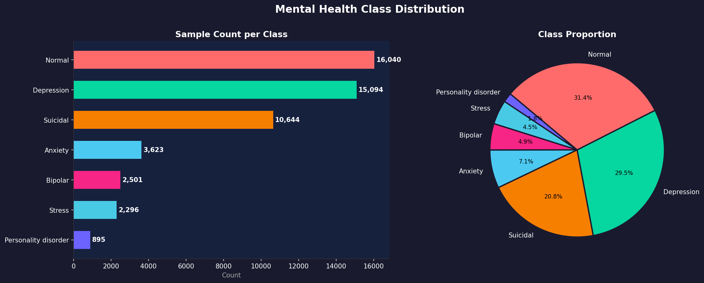
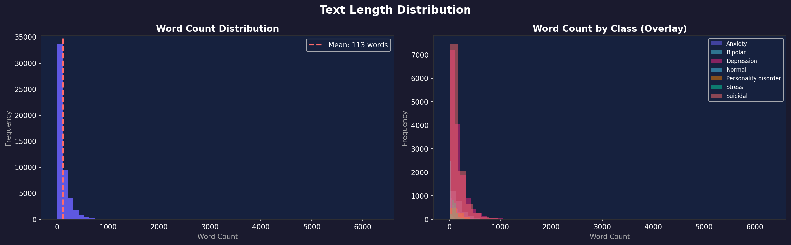
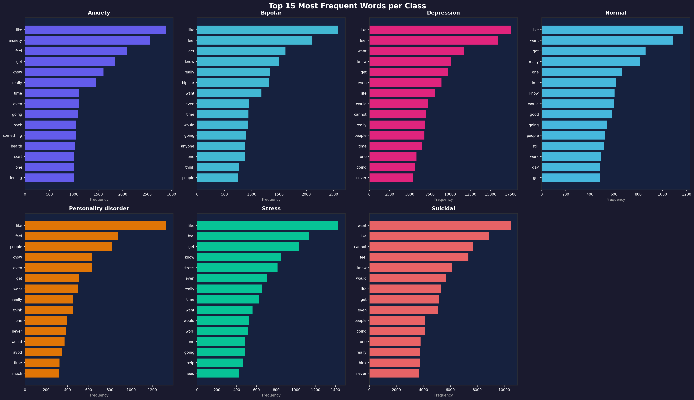
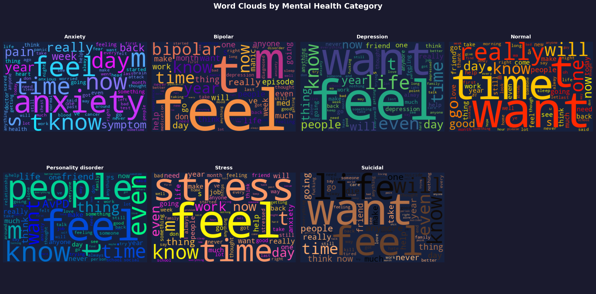
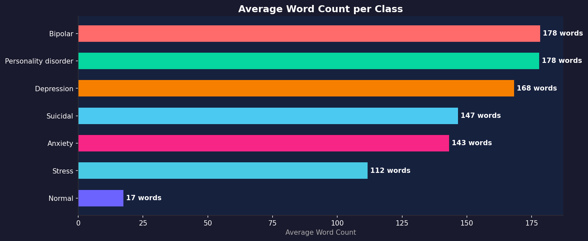

<div align="center">


---

# MindBridge
### Mental Health Text Classification — 7-Class NLP Pipeline

*Classifying mental health status from social media text using TF-IDF and classical ML*

[Live Demo](#streamlit-app) · [Paper](#paper) · [Results](#results) · [Plots](#plots-and-visual-results) · [Setup](#setup)

</div>

---

## Overview

**MindBridge** is an end-to-end NLP pipeline that classifies user-generated text into 7 mental health categories using TF-IDF vectorization and classical machine learning models.

The project focuses on building a lightweight, interpretable system that can still perform well on fine-grained mental health text classification without depending on heavy deep learning infrastructure.

**Target Classes:** Normal · Depression · Anxiety · Stress · Suicidal · Bipolar · Personality Disorder

---

## Results

### Model Comparison

| Model | Accuracy | Weighted F1 | Mean AUC-ROC |
|-------|----------|-------------|--------------|
| Naive Bayes | 67.68% | 66.81% | 0.9082 |
| Random Forest | 69.02% | 66.70% | 0.9218 |
| **Linear SVM** | **72.21%** | 71.77% | 0.9224 |
| Logistic Regression | 72.16% | **72.09%** | **0.9364** |

### Per-Class Performance (Logistic Regression)

| Class | Precision | Recall | F1 Score |
|-------|-----------|--------|----------|
| Stress | 0.46 | 0.56 | 0.50 |
| Personality disorder | 0.58 | 0.51 | 0.54 |
| Depression | 0.70 | 0.60 | 0.65 |
| Suicidal | 0.63 | 0.68 | 0.66 |
| Bipolar | 0.76 | 0.75 | 0.76 |
| Anxiety | 0.74 | 0.80 | 0.77 |
| Normal | 0.89 | 0.92 | 0.90 |

### Ablation Study — TF-IDF Configuration

| Configuration | Weighted F1 |
|--------------|-------------|
| Unigrams only | 0.7127 |
| Vocab 10k | 0.7251 |
| Unigrams + Bigrams | 0.7291 |
| Sublinear TF | 0.7326 |
| **Final config (20k)** | **0.7326** |

### Key Findings
- Linear SVM gave the highest **accuracy**, while Logistic Regression gave the best **weighted F1** and **AUC-ROC**.
- The strongest overall ROC performance came from Logistic Regression with a mean AUC of **0.9364**.
- The most difficult classes are still **Stress** and **Personality disorder**, mainly because of class imbalance and overlap in language.
- **Normal**, **Anxiety**, and **Bipolar** are learned much more clearly by the model.
- TF-IDF design choices such as bigrams, sublinear TF scaling, and a larger vocabulary all improved performance.

---

## Project Structure

```
MIND_BRIDGE/
│
├── data/
│   └── Combined Data.csv          # Kaggle dataset
│
├── notebooks/
│   ├── 00_Problem_Understanding.ipynb
│   ├── 01_EDA.ipynb                # Class distribution, word clouds, top words
│   ├── 02_Preprocessing.ipynb      # Text cleaning, TF-IDF, SMOTE
│   ├── 03_Modeling.ipynb           # Train 4 models, compare results
│   └── 04_Evaluation.ipynb         # ROC-AUC, ablation, interpretability
│
├── models/
│   ├── best_model.pkl
│   ├── tfidf_vectorizer.pkl
│   ├── label_encoder.pkl
│   ├── svm_model.pkl
│   ├── naive_bayes_model.pkl
│   └── random_forest_model.pkl
│
├── results/
│   └── plots/
│       ├── class_distribution.png
│       ├── text_length.png
│       ├── top_words_per_class.png
│       ├── wordclouds.png
│       ├── avg_words_per_class.png
│       ├── cleaning_quality.png
│       ├── model_comparison.png
│       ├── ablation_study.png
│       ├── per_class_f1.png
│       ├── roc_auc_curves.png
│       └── top_features_per_class.png
│
├── app.py
├── requirements.txt
└── README.md
```

---

## Dataset

| Property | Value |
|----------|-------|
| Source | [Kaggle — Sentiment Analysis for Mental Health](https://www.kaggle.com/datasets/suchintikasarkar/sentiment-analysis-for-mental-health) |
| Total samples | ~53,000 |
| After cleaning | 51,093 |
| Features | `statement` (text), `status` (label) |
| Classes | 7 |
| Split | 70% train / 15% val / 15% test (stratified) |

### Class Distribution

| Class | Samples | % of Data | Avg Words |
|-------|---------|-----------|-----------|
| Normal | 16,040 | 31.4% | 17 |
| Depression | 15,094 | 29.5% | 168 |
| Suicidal | 10,644 | 20.8% | 147 |
| Anxiety | 3,623 | 7.1% | 143 |
| Bipolar | 2,501 | 4.9% | 178 |
| Stress | 2,296 | 4.5% | 112 |
| Personality disorder | 895 | 1.8% | 178 |

---

## Pipeline

```
Raw Text
   ↓
Text Cleaning (lowercase, URLs, punctuation, stopwords, lemmatization)
   ↓   Average word reduction: 50.6% to 58.2% depending on class
TF-IDF Vectorization (20k features, unigrams + bigrams, sublinear TF)
   ↓
Train/Val/Test Split (70/15/15, stratified)
   ↓
Model Training (LR, NB, RF, SVM)
   ↓
Evaluation (Accuracy, Weighted F1, AUC-ROC, Confusion Matrix, ROC Curves)
   ↓
Feature Analysis (top words, word clouds, top TF-IDF features)
```

---

## Plots and Visual Results

Below are the result plots used in the project. Each one is included with its file name so the repo stays easy to navigate.

### 1. Mental Health Class Distribution  
**File:** `results/plots/class_distribution.png`



### 2. Text Length Distribution  
**File:** `results/plots/text_length.png`



### 3. Top 15 Most Frequent Words per Class  
**File:** `results/plots/top_words_per_class.png`



### 4. Word Clouds by Mental Health Category  
**File:** `results/plots/wordclouds.png`



### 5. Average Word Count per Class  
**File:** `results/plots/avg_words_per_class.png`



### 6. Text Cleaning Quality Check  
**File:** `results/plots/cleaning_quality.png`


### 7. Model Comparison  
**File:** `results/plots/model_comparison.png`


### 8. Ablation Study (TF-IDF Configuration)  
**File:** `results/plots/ablation_study.png`


### 9. Per-Class Precision, Recall, and F1 Score  
**File:** `results/plots/per_class_f1.png`


### 10. ROC-AUC Curves by Model  
**File:** `results/plots/roc_auc_curves.png`


### 11. Top 20 TF-IDF Features per Class (Logistic Regression)  
**File:** `results/plots/top_features_per_class.png`


---

## Streamlit App

A live web application for real-time mental health text classification.

**Features:**
- Real-time 7-class prediction
- Confidence scores with visual bars
- Color-coded results per mental health category
- Crisis resources for high-risk predictions
- Text statistics panel

**Run locally:**
```bash
streamlit run app.py
```

---

## Setup

```bash
# 1. Clone the repository
git clone https://github.com/Vaibhav2040/MindBridge.git
cd MindBridge

# 2. Create virtual environment
python -m venv venv
venv\Scripts\activate   # Windows
# source venv/bin/activate   # macOS / Linux

# 3. Install dependencies
pip install -r requirements.txt

# 4. Download NLTK data
python -c "import nltk; nltk.download('stopwords'); nltk.download('wordnet'); nltk.download('punkt')"

# 5. Run notebooks in order
jupyter notebook notebooks/00_Problem_Understanding.ipynb

# 6. Launch web app
streamlit run app.py
```

---

## Technologies

| Category | Tools |
|----------|-------|
| Language | Python 3.13 |
| ML | scikit-learn, imbalanced-learn |
| NLP | NLTK, TF-IDF |
| Visualization | matplotlib, seaborn, wordcloud |
| Web App | Streamlit |
| Data | pandas, numpy, scipy |
| Version Control | Git, GitHub |

---

## Paper

This project is accompanied by a research paper:

**MindBridge: Mental Health Text Classification Using TF-IDF and Machine Learning**  
Vaibhav Hasmukh Bhai Patel · Siddharth Sunil Jadhav

---

## Authors

| Name | Student ID | Contributions |
|------|-----------|---------------|
| Vaibhav HasmukhBhai Patel | U01130755 | Conceptualization, Methodology, Software, Visualization, Writing |
| Siddharth Sunil Jadhav | U01108649 | Data Curation, Preprocessing, Validation, Writing — Review |

---

## Disclaimer

This project is for research and educational purposes only. MindBridge is not a medical diagnostic tool and should not be used as a substitute for professional mental health evaluation or treatment.

---

## License

MIT License — see [LICENSE](LICENSE) for details.

---

<div align="center">
<sub>MindBridge · github.com/Vaibhav2040/MindBridge</sub>
</div>
